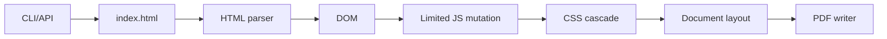

# htmlpdf

`htmlpdf` is an experimental lightweight HTML/CSS/limited-JS to PDF renderer.
It is intentionally **not Chromium** and not a full browser. The first product
version targets controlled document templates: invoices, reports, certificates,
contracts, and exportable dashboard snapshots.

## Why this exists

The usual `puppeteer + chromium -> render -> pdf` pipeline has excellent web
compatibility, but it pays for a full browser: binary size, cold-start latency,
process overhead, and operational complexity. This project explores the opposite
trade-off: a small deterministic renderer for document HTML.

## Workspace

- `crates/htmlpdf-core` — parser, CSS cascade, limited JS, layout, PDF writer.
- `crates/htmlpdf-cli` — `htmlpdf` command.
- `crates/htmlpdf-server` — minimal HTTP API service using the same core.

The current MVP has no third-party runtime dependencies. That keeps the first
iteration portable and makes every rendering stage visible before introducing
specialized crates.

## CLI

```bash
cargo run -p htmlpdf-cli -- render examples/invoice.html -o out.pdf
cargo run -p htmlpdf-cli -- render examples/invoice.html -o out.pdf --page A4 --margin 42 --js on --timeout-ms 250
cargo run -p htmlpdf-cli -- render examples/*.html -o out-examples
cargo run -p htmlpdf-cli -- render examples/*.html -o out.pdf
```

Options:

- `--page A4|Letter`
- `--margin <pt>` uniform page margin in PDF points; when omitted, the CLI uses a Chromium-like default Letter page with a 28.35 pt print margin unless CSS `@page` overrides it
- `--js on|off` limited deterministic script support
- `--timeout-ms <ms>` script execution budget
- `--render-mode generic|demo-fixture` where `generic` is the default. `demo-fixture` is only for repository visual-regression demos, not production use.

## Visual smoke testing

Render every example through the real CLI and rasterize the first PDF page:

```bash
./scripts/render-examples-visual.sh
```

Outputs:

- `out-examples/*.pdf`
- `out-raster/*.png`

When comparing against browser output, use Playwright/Chromium screenshots with
the same viewport size as the PDF raster, then compare with ImageMagick. Pair
that visual RMSE signal with semantic page/text parity so matching page counts
do not hide shifted content:

```bash
scripts/audit-pdf-text-parity.py \
  docs/visual-regression/artifacts/browser-parity/report.htmlpdf.pdf \
  docs/visual-regression/artifacts/browser-parity/report.chromium.pdf \
  --label-left htmlpdf --label-right chromium --mode layout --pages all \
  --out docs/visual-regression/artifacts/browser-parity/report.text-parity.json
```

This browser-parity workflow is used to catch layout regressions while generic
renderer support is expanded.

## API service

```bash
cargo run -p htmlpdf-server -- 127.0.0.1:4000
curl -X POST --data-binary @examples/invoice.html http://127.0.0.1:4000/render > out.pdf
```

## Open-source contract

The default CLI/API path is a generic renderer. It must not silently detect one
specific template and replace it with hardcoded coordinates. Demo fixture
compositors may exist for visual regression, but they are opt-in only via
`--render-mode demo-fixture`. See
`docs/adr/0001-generic-renderer-no-silent-fixtures.md` and
`docs/architecture/generic-rendering-strategy.md`.

## Supported v1 subset

HTML:

- Block document structure: `html`, `body`, `main`, `section`, `article`, `div`
- Text blocks: `h1`, `h2`, `h3`, `p`, `small`
- Basic table layout: `table`, `thead`, `tbody`, `tfoot`, `tr`, `th`, `td`, including nested block text inside cells and rounded header backgrounds for `border-radius` tables
- Metadata ignored: `head`, `title`, `meta`
- HTML comments are ignored without leaking tag-like text; common named entities plus decimal and hexadecimal numeric character references are decoded in text and attributes
- `style` and `script` are consumed by the renderer, not painted
- First-pass inline SVG shapes: `svg`, filled/stroked `rect`, `circle`, stroked `circle`, `line`, `polygon`, `text`, and basic `path` commands (`M`, `L`, `H`, `V`, `C`, `Q`, `Z`) with `viewBox`, basic fill/stroke colors, `fill-opacity`, `stroke-opacity`, `stroke-linecap="round"`, `currentColor`, and averaged-stop fallback for `url(#linearGradient)`/`url(#radialGradient)` paint servers including `stop-opacity`

CSS:

- Tag, `.class`, `#id`, compound selectors (`section.card.primary`), descendant selectors (`.shell .card h1`), attribute selectors (`[data-state]`, `[data-state="active"]`, `~=`, `|=`, `^=`, `$=`, `*=`), structural pseudo-classes, `:not(...)`, descendant `:has(...)`, first-pass CSS nesting (`& .child`), and `:where(...)`/`:is(...)` selector-list functions expanded across all arguments for modern framework CSS
- Inline `style` attributes and local `<link rel="stylesheet" href="...">` stylesheets resolved from the HTML file directory in the CLI
- `display: none|block|inline|inline-block|contents|flow-root|table`; first-pass `flex`/`inline-flex`/`grid` layout with `gap`, explicit/intrinsic flex item widths, shrink-to-content inline-flex boxes, `justify-content`, `align-items`, `grid-template-columns` fractional `fr` tracks, fixed tracks, `repeat(n, ...)`, and first-pass `place-items`
- First-pass `overflow: hidden|clip` clipping for rectangular and rounded containers
- Browser-like non-painted content handling for `hidden`, `aria-hidden="true"`, `visibility: hidden`, `template`, and unsupported embedded media containers such as `iframe`
- Box model: margins, padding, `width`, `min-width`, `max-width`, `height`, `min-height`, plus first-pass logical aliases such as `inline-size`, `min-block-size`, `padding-inline`, `margin-block`, and `border-inline-start`
- First-pass positioned layout for `position: relative|absolute|fixed|sticky` with `top`, `right`, `bottom`, `left`, and logical `inset-*` aliases; absolute/fixed boxes are painted out of normal flow
- Modern length functions for layout-critical properties: `calc(...)`, `min(...)`, `max(...)`, `clamp(...)`, percentages, `px`, `pt`, `mm`, `cm`, `in`, `rem`, `em`
- Inherited text styling: `font-size`, `line-height`, `font-family` mapped to built-in sans/serif/monospace PDF fonts, `font-weight`, `letter-spacing`, `text-transform`, `<br>` hard line breaks, `white-space`, `overflow-wrap`, `color`, `text-align`
- Backgrounds and effects: solid/alpha colors, first-pass angle-aware multi-stop `linear-gradient(...)` including positioned stops and linear layers inside compound `background`, document-level body/html backgrounds bounded to the print content box with white print-margin masks, first-pass text `transform: rotate(...)`, first-pass `box-shadow`, and `filter: drop-shadow(...)` mapped to the lightweight shadow model
- First-pass inherited subtree opacity approximation via `opacity`
- Borders: `border`, side borders (`border-left`, `border-bottom`, etc.), `border-width`, `border-color`, `border-radius`, style-aware table cell borders, plus first-pass `border-collapse: collapse` table row/border compaction
- At-rules and print CSS: first-pass `@media print`, page-width `@media (max-width: ...)`/`(min-width: ...)` and modern range syntax such as `(width >= 40rem)`, positive `@supports (...)`, `@layer ... { ... }`, positive `@container ... { ... }`, scoped `@scope (.root) { ... }`, `@page size`, `@page margin`, mixed page sizes in combined PDFs, page-break hints, and repeated table headers across pages
- Colors/backgrounds: named colors, `transparent`, `currentColor`, `#rgb`, `#rgba`, `#rrggbb`, `#rrggbbaa`, `rgb(...)`, `rgba(...)`, `hsl(...)`, `hsla(...)`, `oklch(...)`, `light-dark(...)`, first-pass `color-mix(in srgb, ..., transparent N%)`, multi-stop `linear-gradient(...)`, and soft-circle fallback for `radial-gradient(...)`
- CSS custom properties: inherited per-element, case-preserving `--var` values with nested `var(--name, fallback)` resolution

Limited JS:

```html
<script>
  document.querySelector("#title").textContent = "Invoice #1001";
  document.querySelector(".customer").textContent = "Ada Lovelace";
  htmlpdf.setText(".fallback", "Optional htmlpdf helper");
</script>
```

Supported statements:

- `document.querySelector("selector").textContent = "value";`
- `htmlpdf.setText("selector", "value");`

Selectors are simple `#id`, `.class`, or tag selectors. There is no network,
no browser event loop, no layout events, no DOM API beyond the documented subset.
That is a feature, not a bug: deterministic document generation beats fake
browser compatibility.

## Architecture



## Important limitation

If you need full browser-accurate web-page rendering today, use Chromium.
Recreating Chromium badly is architectural debt. `htmlpdf` aims to accept any
document HTML input, but it will expose an explicit compatibility matrix and
render the supported subset deterministically rather than pretending every web
platform feature exists.
